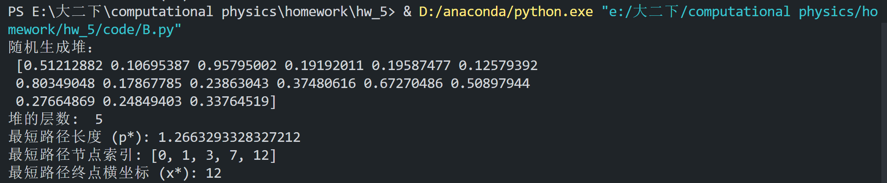
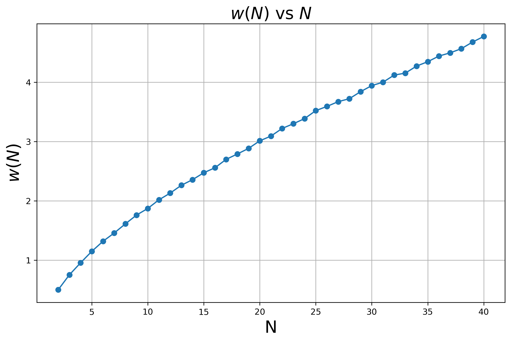
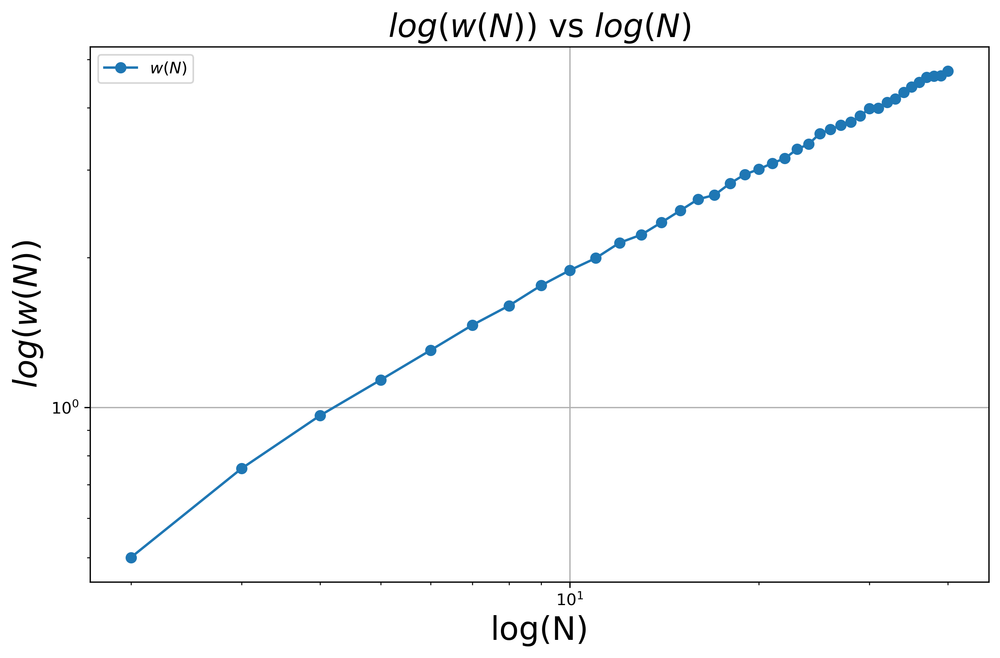
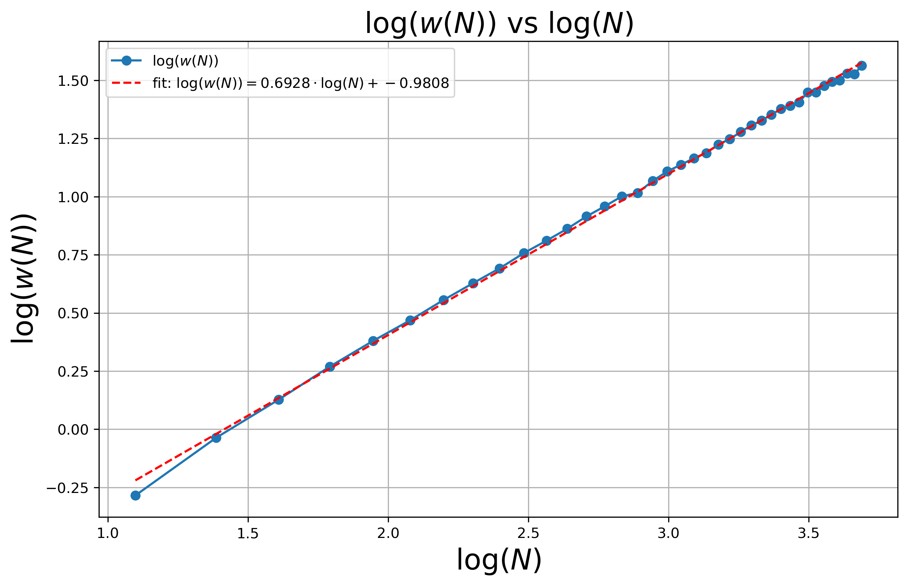

# A.TSSP方法&GP方程
# B.堆上的最短路径
定义这样一个总共$N$层$(N\in\mathbb{N})$的堆和其上的“最短路径”如图：
(a).第$n$层拥有$n+1$个节点$v_i^n.$
(b).每个节点$v_i^n$指向$n+1$层的两个子节点$v_i^{n+1},v_{i+1}^{n+1}.$ 
(c).每个点$v_i^n$上的取值是一个[0,1)上均匀分布的随机数
(d).从根节点$v_0^0$起，选择一条深度$n$递增的路径直到最底层$N$。路径的长度$L($path$) = \sum ^{v\in \mathrm{path}}v$
(e). 最短路径为$p^\star=\operatorname{argmin}[L($path)]。与此同时，记录下最短路径的终点横坐标$x^\star.$
## 1. 随机生成这样一个堆
由于这个堆能够满足结构上的完整性，那么对于堆上的每一个点都有确定的编号，可以采取顺序存储，用数组的形式存储。
生成这样一个堆的过程如下：
1. 对于$N$层的堆，其节点总数为$\frac{N(N+1)}{2}$，需要建立一个长度为 $\frac{N(N+1)}{2}$ 的数组
2. 为了保证每个节点$v_i^n$指向$n+1$层的两个子节点$v_i^{n+1},v_{i+1}^{n+1}.$，可以发现，如果第$n$层的某个节点的编号是$a$，则其只想的$n+1$层的两个节点的编号分别为$a+n$和$a+n+1$。这样就确定了各个节点的连接关系
3. 使每个点$v_i^n$上的取值是一个[0,1)上均匀分布的随机数
这样就完成了一个堆的构建

## 2. 找到最短路径p*和终点横坐标x*.呈现代码并阐述使用的算法及其复杂度
### 呈现代码
```python
import numpy as np
import matplotlib.pyplot as plt
import matplotlib.animation as animation
import matplotlib.patches as patches

# 生成堆
def build_heap(N: int) -> np.ndarray:
    """
    输出：heap: 以一维数组形式存储的完整堆
    """
    length = N * (N + 1) // 2  
    heap = np.random.rand(length)  
    return heap

# 找到最短路径
def find_shortest_path(heap: np.ndarray, N: int):
    """
    输出：
        shortest_path: 最短路径长度
        x_star: 最短路径的终点横坐标
    """
    length = N * (N + 1) // 2 
    min_path = np.zeros(length, dtype=float)  
    identical_path_total = []
    for i in range(length):
        identical_path_total.append([i])

    start_index = N * (N - 1) // 2  
    min_path[start_index:] = heap[start_index:]

    for i in range(start_index - 1, -1, -1): 

        n = [n for n in range(1, N + 1) if n * (n - 1) // 2 <= i < n * (n + 1) // 2]
        n_int = n[0] if n else 0  # 确定当前节点所在层数

        left_child = i + n_int
        right_child = i + n_int + 1

        if min_path[left_child] <= min_path[right_child]:
            min_path[i] = heap[i] + min_path[left_child]
            identical_path_total[i].extend(identical_path_total[left_child])
        else:
            min_path[i] = heap[i] + min_path[right_child]
            identical_path_total[i].extend(identical_path_total[right_child])

    shortest_path = min_path[0]  
    important_nodes = identical_path_total[0]
    x_star = important_nodes[-1]
    return shortest_path, x_star,important_nodes

if __name__ == "__main__":
    # 示例运行
    N = 5
    heap = build_heap(N)
    shortest_path, x_star,important_nodes= find_shortest_path(heap, N)

    print("随机生成堆：\n", heap)
    print("堆的层数: ", N)
    print(f"最短路径长度 (p*): {shortest_path}")
    print(f"最短路径节点索引: {important_nodes}")
    print(f"最短路径终点横坐标 (x*): {x_star}")
    

```
### 代码运行结果（示例）

由上图可以看出代码确实找到了最短路径，是正确的。
### 算法思路如下：
数据说明：
min_path:表示该节点向下的最小路径长度
identical_path_total:列表，表示各个节点向下的最短路径
算法阐述如下：

1. 初始化动态规划表 `min_path`：

\[
\text{min\_path[i]} = \text{heap[i]}, \quad \text{对于所有最底层节点 } i.
\]

2. 初始化路径列表 `identical_path_total`。最底层节点的路径仅包含自己。

3. 从倒数第 \( N-1 \) 层开始递推，直到根节点：

   - 对于层数为 \( n \) 的某节点 \( v_i \)，通过以下递推公式计算节点 \( v_i \) 到达底部的最短路径值：
      \[
      \text{min\_path[i]} = \text{heap[i]} + \min(\text{min\_path[left\_child]}, \text{min\_path[right\_child]}).
      \]

   - 同时更新路径记录 `identical_path_total[i]`：
      - 如果左子节点的最小路径小于等于右子节点，则当前节点连向左子节点，将左子节点路径扩展到当前路径。
      - 否则连向右子节点，将右子节点路径扩展到当前路径。


4. 根节点的最小路径值即为整棵堆的最短路径长度：
   \[
   \text{shortest\_path} = \text{min\_path[0]}.
   \]最短路径的所有节点索引记录于 `identical_path_total[0]`。最短路径的终点横坐标 \( x^\star \) 即为保存的路径中最后一个节点的索引：
   \[
    x^\star = \text{identical\_path\_total[0][-1]}
   \]


### 时间复杂度分析

每个节点在计算路径值时，需要访问其两个子节点并选择最小值。对于每一层需要比较n次，一共N层，则算法复杂度为：
\[
O(T) = \sum_{n=1}^{N}n=\left(\frac{N \cdot (N+1)}{2}\right)\approx O(N^2)=O(N_{nodes}).
\]

此处`N`表示层数，`N_nodes`表示总的节点数

### 空间复杂度分析
此处尽分析算法额外占用的空间，不考虑构建堆所占用的空间 
1. 最短路径数组 `min_path`：动态规划表与堆同大小，即 \( O(N^2) \)。

1. 路径追踪数组 `identical_path_total`：存储每个节点的最短路径（节点索引），复杂度仍为 \( O(N^2) \)。

总空间复杂度共需 \( O(N^2) =O(N_{nodes})\)：


## 3. 计算$w(N)=\sqrt{\langle[x^\star(N)]^2\rangle-\langle x^\star(N)\rangle^2}$随着堆的高度N的变化规律
对于$N\in[2,40]$，给出$w(N)=\sqrt{\langle[x^\star(N)]^2\rangle-\langle x^\star(N)\rangle^2}$随N的变化关系为：

猜测$w(N)=\sqrt{\langle[x^\star(N)]^2\rangle-\langle x^\star(N)\rangle^2}$与N之间存在幂律关系，两边取对数，得到：

由上图可以发现$log(w)$与$log(N)$之间存在很好的线性性，证实了$w(N)=\sqrt{\langle[x^\star(N)]^2\rangle-\langle x^\star(N)\rangle^2}$与N之间存在幂律关系。
进行直线拟合：

拟合结果：
$log(w) = 0.6928log(N)-0.9808$
那么：
$$ w(N) = 10^{-0.9808} \cdot N^{0.6928}$$ 即：$$  w(N) \propto N^{0.6928} $$

## 4. 解释规律
