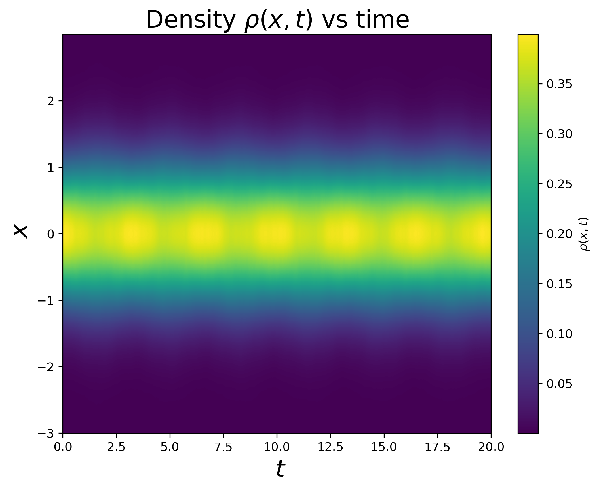
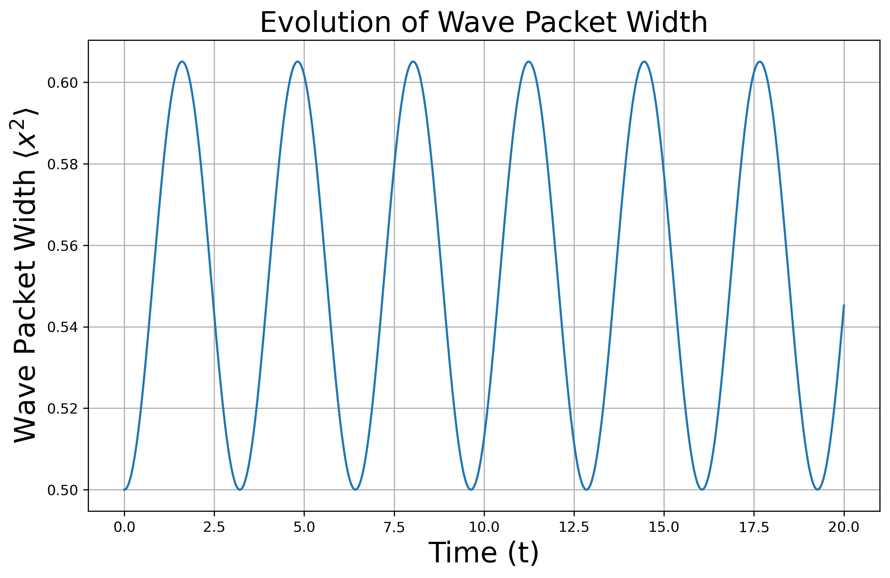

# A.TSSP方法&GP方程

使用时间分裂谱方法(time-splitting spectral, TSSP) 求解一维的含时Gross-Pitaevskii方程

$$i\frac{\partial}{\partial t}\psi(x,t) = -\frac{1}{2}\frac{\partial^2}{\partial x^2}\psi(x,t) + V(x)\psi(x,t) + \eta(\psi)\psi(x,t).$$

其中，势能项取谐振子势 $V(x)=\frac{1}{2}x^2$, 非线性项 $\eta(\psi)=\frac{1}{2}|\psi|^2$. 波函数初始条件为

$$|\psi(x,0)|=\frac{1}{\sqrt{2\pi}}e^{-x^2/2}.$$

## 1. 写出TSSP方法的基本原理
包括如何分解哈密顿量以及怎么处理动能项和势能项。为了方便求解，你需要怎样的边界条件？对一维问题，TSSP方法的计算复杂度是多少？（1.5分）

1. **分解哈密顿量：**
$$H = -\frac{1}{2}\frac{\partial^2}{{\partial x}^2}+\frac 12x^2+\frac12|\psi|^2$$


$$H=T+V$$

其中：

动能项$( T) :$ $T= - \frac 12\frac {\partial ^2}{\partial x^2}$
势能项$( V) :$ $V( x) = \frac 12x^2+\frac12|\psi|^2$
那么在每一个时间步上可以这样分解：
$$e^{-iH\Delta t}\approx e^{-iT\Delta t/2}e^{-i(V+N)\Delta t}e^{-iT\Delta t/2}.$$
2. **处理动能项**
$$\mathrm{i}\psi_t=-\frac{1}{2}\psi_{xx},$$
- 利用 FFT 将$\psi(x,t)$转换到傅里叶空间$\hat{\psi}(k,t):$
$$i\hat{\psi}_t(k,t)=\frac{1}{2}k^2\hat{\psi}(k,t).$$

- 在傅里叶空间中进行如下演化($k$为波数):

$$\hat{\psi}(k,t+\Delta t)=\hat{\psi}(k,t)\cdot\exp\Bigg(-i\frac{k^2\Delta t}{2}\Bigg).$$

<!-- - 通过逆傅里叶变换 (IFFT) 回到物理空间：
$$\psi(x,t+\Delta t)=\mathrm{IFFT}[\hat{\psi}(k,t+\Delta t/2)].$$ -->

3. **处理势能项**
$$i\frac{\partial}{\partial t}\psi(x,t) = \frac{1}{2}x^2\psi(x,t) + \frac12|\psi|^2\psi(x,t).$$
则有
$$\psi(x_j,t+\Delta t/2)=\psi(x_j,t)\cdot\exp\left(i\frac{\Delta t}{2}\left(-\frac{x^2}{2}-\frac{1}{2}|\psi(x_j,t)|^2\right)\right).$$
4. **时间演化：**
- 在实空间中演化半步势能项$e^{-iH_V\Delta t/2}$，演化方式见上面分析

- 在傅里叶空间中演化一步动能项$e^{-iH_T\Delta t}$，演化方式见上面分析

- 再次在实空间中演化半步势能项$e^{-iH_V\Delta t/2}$，演化方式见上面分析

5. **方便求解的边界条件：**
由于动能项需要使用傅里叶变换，边界条件通常取周期边界条件，使
得波函数的值在两端点处相等：

$$\psi(x_{\min},t)=\psi(x_{\max},t).$$

6. **计算复杂度**
计算复杂度主要来自于傅里叶变换，势能项演化的时间复杂度为$O(N)$,相比之下一次快速傅里叶变换的复杂度为$O(Nlog(N))$
因而计算复杂度为$$O(2Nlog(N))=O(Nlog(N))$$

**代码呈现：**
```python
def calculate_phi_and_density(x:np.ndarray,t0:float,tf:float,dt:float,phi_0:np.ndarray,V)->tuple[np.ndarray,np.ndarray,np.ndarray]:
    """
    输入：
        x: 离散的位置坐标
        t0: 初始时间
        tf: 结束时间
        dt: 时间步长
        phi_0: 初始波函数
        V: 势能函数
    输出：
        phi: 波函数随时间演化的结果，是二维数组，
              第一维是时间步数，第二维是空间坐标点数
        t: 时间数组
    """
    
    dx = x[1] - x[0]  
    t = np.arange(t0, tf, dt)
    num_t = len(t)
    phi = np.zeros((num_t, len(x)), dtype=complex)
    density = np.zeros((num_t, len(x)), dtype=float)
    current_phi = phi_0
    k = 2*np.pi*np.fft.fftfreq(len(x), dx)  # 频率空间的波数
    for i in range(num_t):
        current_phi =current_phi*np.exp(-1j*dt*V(x,current_phi)/2)
        k_phi = np.fft.fft(current_phi)  # 傅里叶变换
        k_phi = k_phi*np.exp(-1j*dt*k**2/2)
        current_phi = np.fft.ifft(k_phi)
        current_phi = current_phi*np.exp(-1j*dt*V(x,current_phi)/2)
        phi[i,:] = current_phi
        density[i,:] = np.abs(current_phi)**2
    return phi, density, t
```

## 2. 画出$\rho$的热力图
选取时间范围 $t \in [0,20]$, 求解密度函数 $\rho(x,t) \equiv |\psi(x,t)|^2$ 随着时间的演化情况。画出$\rho$的热力图（横轴为$t$，纵轴为$x$）。你发现了什么？（1分）

画出$\rho$的热力图如下：


由上图可以发现：
1. 波函数主要集中在x=0处
2. 随着时间的演化，波函数呈现出周期性的波包，波包周期性的变大变小，宽度随时间周期性变化

## 3. 波包宽度的演化情况
画出同样时间内，波包宽度的演化情况。波包宽度定义为 $w(t) \equiv (x^2)(t)$。你发现了什么？（1分）


由上图可以发现：
1. 该系统是周期性的系统
2. $x^2$的期望值呈现出周期性的变大变小，说明波包在进行类似简谐振子的运动
3. 波包$x^2$的期望值振荡的幅值保持不变，说明这是一个较为稳定的系统


## 4. 定性解释
结合GP方程的物理意义，定性解释上述现象。（1分）
1. **波包围绕 $x=0$ 振荡**

   由于外加势 $V(x) = \frac{1}{2}x^2$ 是谐振子势，波包受到一个回弹力，使得它在势阱内振荡，就像一个受限在势阱中的粒子。

   这导致波函数的密度分布 $\rho(x,t) = |\psi(x,t)|^2$ 在 $x=0$ 附近集中，随时间表现出周期性收缩和扩展。
2. **波包宽度周期性变化**

   从 $w(t) = \langle x^2 \rangle$ 的演化可以看出，波包的大小随着时间周期性增大和减小，这表明它在做振荡。

   这种行为的主要原因是：

   势能项 使波包趋向 $x=0$ 运动（就像一个谐振子）。

   非线性项 代表了粒子之间的相互作用，当密度高时会提供额外的“压缩”效应，而密度低时则减弱。

   这两个效应相互作用，导致波包周期性地被压缩和扩展。
3. **系统的稳定性**

   系统类似于一个有压缩机制的简谐振子，没有能量损失项，因此系统振幅稳定

   

## 5. TSSP方法的优势
你体会到TSSP方法有什么优势？（0.5分）
1. **精度高**
   传统的高阶求导的方法例如$$\frac{\partial^2}{{\partial x}^2}f = \frac{f(x+h)-2f(x)+f(x-h)}{{\Delta x}^2}$$
   在$\Delta x$较小的时候精度非常差，TSSP方法可以通过傅里叶变换处理动能项避免这样求高阶导数，精度高
2. **计算复杂度低**

   TSSP 主要依赖快速傅里叶变换（FFT），其复杂度为 $O(N\log N)$，比传统有限差分法 $O(N^2)$ 更高效
3. **适用于非线性系统**
   TSSP 可以高效处理 GP 方程的非线性项（如 $|\psi|^2$），适用于玻色-爱因斯坦凝聚（GP问题）、非线性光学等问题。

# B.堆上的最短路径
定义这样一个总共$N$层$(N\in\mathbb{N})$的堆和其上的“最短路径”如图：
(a).第$n$层拥有$n+1$个节点$v_i^n.$
(b).每个节点$v_i^n$指向$n+1$层的两个子节点$v_i^{n+1},v_{i+1}^{n+1}.$ 
(c).每个点$v_i^n$上的取值是一个[0,1)上均匀分布的随机数
(d).从根节点$v_0^0$起，选择一条深度$n$递增的路径直到最底层$N$。路径的长度$L($path$) = \sum ^{v\in \mathrm{path}}v$
(e). 最短路径为$p^\star=\operatorname{argmin}[L($path)]。与此同时，记录下最短路径的终点横坐标$x^\star.$
## 1. 随机生成这样一个堆
由于这个堆能够满足结构上的完整性，那么对于堆上的每一个点都有确定的编号，可以采取顺序存储，用数组的形式存储。
生成这样一个堆的过程如下：
1. 对于$N$层的堆，其节点总数为$\frac{N(N+1)}{2}$，需要建立一个长度为 $\frac{N(N+1)}{2}$ 的数组
2. 为了保证每个节点$v_i^n$指向$n+1$层的两个子节点$v_i^{n+1},v_{i+1}^{n+1}.$，可以发现，如果第$n$层的某个节点的编号是$a$，则其只想的$n+1$层的两个节点的编号分别为$a+n$和$a+n+1$。这样就确定了各个节点的连接关系
3. 使每个点$v_i^n$上的取值是一个[0,1)上均匀分布的随机数

这样就完成了一个堆的构建，具体代码见附录。

## 2. 找到最短路径p*和终点横坐标x*.呈现代码并阐述使用的算法及其复杂度
### 呈现代码
```python
import numpy as np
import matplotlib.pyplot as plt
import matplotlib.animation as animation
import matplotlib.patches as patches

# 生成堆
def build_heap(N: int) -> np.ndarray:
    """
    输出：heap: 以一维数组形式存储的完整堆
    """
    length = N * (N + 1) // 2  
    heap = np.random.rand(length)  
    return heap

# 找到最短路径
def find_shortest_path(heap: np.ndarray, N: int):
    """
    输出：
        shortest_path: 最短路径长度
        x_star: 最短路径的终点横坐标
    """
    length = N * (N + 1) // 2 
    min_path = np.zeros(length, dtype=float)  
    identical_path_total = []
    for i in range(length):
        identical_path_total.append([i])

    start_index = N * (N - 1) // 2  
    min_path[start_index:] = heap[start_index:]

    for i in range(start_index - 1, -1, -1): 

        n = [n for n in range(1, N + 1) if n * (n - 1) // 2 <= i < n * (n + 1) // 2]
        n_int = n[0] if n else 0  # 确定当前节点所在层数

        left_child = i + n_int
        right_child = i + n_int + 1

        if min_path[left_child] <= min_path[right_child]:
            min_path[i] = heap[i] + min_path[left_child]
            identical_path_total[i].extend(identical_path_total[left_child])
        else:
            min_path[i] = heap[i] + min_path[right_child]
            identical_path_total[i].extend(identical_path_total[right_child])

    shortest_path = min_path[0]  
    important_nodes = identical_path_total[0]
    x_star = important_nodes[-1]
    return shortest_path, x_star,important_nodes

if __name__ == "__main__":
    # 示例运行
    N = 5
    heap = build_heap(N)
    shortest_path, x_star,important_nodes= find_shortest_path(heap, N)

    print("随机生成堆：\n", heap)
    print("堆的层数: ", N)
    print(f"最短路径长度 (p*): {shortest_path}")
    print(f"最短路径节点索引: {important_nodes}")
    print(f"最短路径终点横坐标 (x*): {x_star}")
    

```
### 代码运行结果（示例）

由上图可以看出代码确实找到了最短路径，是正确的。
### 算法思路如下：
数据说明：
min_path:表示该节点向下的最小路径长度
identical_path_total:列表，表示各个节点向下的最短路径
算法阐述如下：

1. 初始化动态规划表 `min_path`：

\[
\text{min\_path[i]} = \text{heap[i]}, \quad \text{对于所有最底层节点 } i.
\]

2. 初始化路径列表 `identical_path_total`。最底层节点的路径仅包含自己。

3. 从倒数第 \( N-1 \) 层开始递推，直到根节点：

   - 对于层数为 \( n \) 的某节点 \( v_i \)，通过以下递推公式计算节点 \( v_i \) 到达底部的最短路径值：
      \[
      \text{min\_path[i]} = \text{heap[i]} + \min(\text{min\_path[left\_child]}, \text{min\_path[right\_child]}).
      \]

   - 同时更新路径记录 `identical_path_total[i]`：
      - 如果左子节点的最小路径小于等于右子节点，则当前节点连向左子节点，将左子节点路径扩展到当前路径。
      - 否则连向右子节点，将右子节点路径扩展到当前路径。


4. 根节点的最小路径值即为整棵堆的最短路径长度：
   \[
   \text{shortest\_path} = \text{min\_path[0]}.
   \]最短路径的所有节点索引记录于 `identical_path_total[0]`。最短路径的终点横坐标 \( x^\star \) 即为保存的路径中最后一个节点的索引：
   \[
    x^\star = \text{identical\_path\_total[0][-1]}
   \]


### 时间复杂度分析

每个节点在计算路径值时，需要访问其两个子节点并选择最小值。对于每一层需要比较n次，一共N层，则算法复杂度为：
\[
O(T) = \sum_{n=1}^{N}n=\left(\frac{N \cdot (N+1)}{2}\right)\approx O(N^2)=O(N_{nodes}).
\]

此处`N`表示层数，`N_nodes`表示总的节点数

### 空间复杂度分析
此处尽分析算法额外占用的空间，不考虑构建堆所占用的空间 
1. 最短路径数组 `min_path`：动态规划表与堆同大小，即 \( O(N^2) \)。

1. 路径追踪数组 `identical_path_total`：存储每个节点的最短路径（节点索引），复杂度仍为 \( O(N^2) \)。

总空间复杂度共需 \( O(N^2) =O(N_{nodes})\)：


## 3. 计算$w(N)=\sqrt{\langle[x^\star(N)]^2\rangle-\langle x^\star(N)\rangle^2}$随着堆的高度N的变化规律
对于$N\in[2,40]$，给出$w(N)=\sqrt{\langle[x^\star(N)]^2\rangle-\langle x^\star(N)\rangle^2}$随N的变化关系为：

猜测$w(N)=\sqrt{\langle[x^\star(N)]^2\rangle-\langle x^\star(N)\rangle^2}$与N之间存在幂律关系，两边取对数，得到：

由上图可以发现$log(w)$与$log(N)$之间存在很好的线性性，证实了$w(N)=\sqrt{\langle[x^\star(N)]^2\rangle-\langle x^\star(N)\rangle^2}$与N之间存在幂律关系。
进行直线拟合：

拟合结果：
$log(w) = 0.6928log(N)-0.9808$
那么：
$$ w(N) = 10^{-0.9808} \cdot N^{0.6928}$$ 即：$$  w(N) \propto N^{0.6928} $$

## 4. 解释规律
这个系统类似于高尔顿板，即只有左子<右子的时候才会向左走（当然，这个也取决于后续节点的大小）
对比高尔顿板：
符合二项分布：
对于一个参数为$p$的二项分布，它的标准差为：

$$\sigma=\sqrt{n\cdot p\cdot(1-p)}$$

其中：

$n$是总试验次数(即步数或层数)。

$p$是每一步 "成功" 的概率 (通常指向左或向右的概率)。

$\$1-p\$$是每一步“失败”的概率。

假设高尔顿板中小球左右移动概率相等($p=0.5$),有：

$$\sigma=\sqrt{n\cdot0.5\cdot0.5}\:=\:\sqrt{\frac{n}{4}}=\frac{\sqrt{n}}{2}.$$

**标准差随着 n 的增长：**
- 标准差 σ 和 n 的平方根成正比：σ ∝ √n。
这说明随着层数 n 增加，中性随机分布的离散程度（波动范围）会以次线性速率增加。

换句话说，最短路径的位置随着层数增加会逐渐偏离，但这种偏离的平均幅度增速变缓。

**两个问题的比较：**
- 高尔顿板和二项分布假设每一步是完全随机的，而堆问题中路径的选择不是完全随机的，而是基于最短路径的选择规则（受后边的节点的大小的影响，目标还是总的路径最短，而非直接简单的左子节点和右子节点的比较）。因此结果显示出幂律指数 0.6928，略大于二项分布的指数 0.5。
- 相比于高尔顿板，堆问题的系数大于0.5,因为随机路径的分布更加向边界扩散,路径的选择遵循最短路径规则，即每一步都会倾向于选择权重更小的路径。这种选择规则会打破完全独立的随机性，导致分布出现偏移和幂律特性。。

# 附录
## A
``` python
import numpy as np
import matplotlib.pyplot as plt
import matplotlib.animation as animation

def v(x:np.ndarray,phi:np.ndarray)->np.ndarray:
    """
    势能函数
    输入：x: 离散的位置坐标
    输出：势能值
    """
    # $$\psi(x_j,t+\Delta t/2)=\psi(x_j,t)\cdot\exp\left(i\frac{\Delta t}{2}\left(\frac{x^2}{2}-\frac{1}{2}|\psi(x_j,t)|^2\right)\right).$$
    return 0.5 * x**2 

def phi_origin(x:np.ndarray)->np.ndarray:
    """
    初始波函数
    输入：x: 离散的位置坐标
    输出：初始波函数值
    """
    # $$\psi(x_j,0)=\frac{1}{\sqrt{2\pi}}\exp(-x_j^2/2)\cdot\exp(i\cdot 0.5 \cdot x_j^2).$$     
    return (1 / np.sqrt(2 * np.pi)) * np.exp(-x**2 / 2)

def calculate_phi_and_density(x:np.ndarray,t0:float,tf:float,dt:float,phi_0:np.ndarray,V)->tuple[np.ndarray,np.ndarray,np.ndarray]:
    """
    输入：
        x: 离散的位置坐标
        t0: 初始时间
        tf: 结束时间
        dt: 时间步长
        phi_0: 初始波函数
        V: 势能函数
    输出：
        phi: 波函数随时间演化的结果，是二维数组，
              第一维是时间步数，第二维是空间坐标点数
        t: 时间数组
    """
    
    dx = x[1] - x[0]  
    t = np.arange(t0, tf, dt)
    num_t = len(t)
    phi = np.zeros((num_t, len(x)), dtype=complex)
    density = np.zeros((num_t, len(x)), dtype=float)
    current_phi = phi_0
    k = 2*np.pi*np.fft.fftfreq(len(x), dx)  # 频率空间的波数
    for i in range(num_t):
        current_phi =current_phi*np.exp(-1j*dt*V(x,current_phi)/2)
        k_phi = np.fft.fft(current_phi)  # 傅里叶变换
        k_phi = k_phi*np.exp(-1j*dt*k**2/2)
        current_phi = np.fft.ifft(k_phi)
        current_phi = current_phi*np.exp(-1j*dt*V(x,current_phi)/2)
        phi[i,:] = current_phi
        density[i,:] = np.abs(current_phi)**2
    return phi, density, t

def plot_density(density:np.ndarray,t:np.ndarray,x:np.ndarray)->None:
    """
    输入：
        density: 波函数的密度随时间演化的结果，是二维数组，
                  第一维是时间步数，第二维是空间坐标点数
        t: 时间数组
        x: 离散的位置坐标
    输出：
        无返回值，直接绘制图形，画热图，横轴是时间，纵轴是空间坐标点数
        颜色表示密度值
    """
    fig, ax = plt.subplots(figsize=(10, 6))
    c = ax.pcolormesh(t, x, density.T, shading='auto', cmap='viridis')
    fig.colorbar(c, ax=ax)
    ax.set_title("Density Evolution Over Time",fontsize=20) 
    ax.set_xlabel("Time",fontsize=20)
    ax.set_ylabel("Position",fontsize=20)
    
    path = f"./figure/density_evolution_with_x_from_{x[0]}_to_{x[-1]}_myself.png"
    plt.savefig(path, dpi=300, bbox_inches='tight')
    plt.show()

def calculate_w(density:np.ndarray,x:np.ndarray,t:np.ndarray)->np.ndarray:
    """
    计算波包宽度w(t)
    """
    dx= x[1]-x[0]
    num_t = len(t) 
    w = np.zeros(num_t,dtype=float)  
    for i in range(num_t):
        w[i] = np.sum(x**2 * density[i, :]* dx) 
    return w

def plot_w(w:np.ndarray,t:np.ndarray)->None:
    """
    输入：
        w: 波包宽度随时间演化的结果，是一维数组
        t: 时间数组
    """
    fig, ax = plt.subplots(figsize=(10, 6))
    ax.plot(t, w, label=r"$w(t)$")
    ax.set_title(r"Wave Packet Width Evolution",fontsize=20)
    ax.set_xlabel("Time",fontsize=20)
    ax.set_ylabel(r"$w(t)$",fontsize=20)
    path = f"./figure/w_vs_t.png"
    plt.savefig(path, dpi=300, bbox_inches='tight')
    plt.show()

if __name__ == "__main__":
    t0 = 0
    tf = 20
    dt = 0.01
    N = 1000
    x = np.linspace(-5, 5, N)
    phi_0 = phi_origin(x)
    phi_for_times,density_for_times,t = calculate_phi_and_density(x, t0, tf, dt, phi_0, v)
    plot_density(density_for_times,t,x)
    w = calculate_w(density_for_times,x,t)
    plot_w(w,t)

```

## B
``` python
import numpy as np
import matplotlib.pyplot as plt
import matplotlib.animation as animation
import matplotlib.patches as patches

# 生成堆
def build_heap(N: int, seed: int = None) -> np.ndarray:
    """
    输出：heap: 以一维数组形式存储的完整堆
    参数：
        N: 堆的层数
        seed: 随机数种子，默认为 None
    """
    if seed is not None:
        np.random.seed(seed)  # 设置随机数种子
    length = N * (N + 1) // 2  
    heap = np.random.rand(length)  
    return heap

# 找到最短路径
def find_shortest_path(heap: np.ndarray, N: int):
    """
    输出：
        shortest_path: 最短路径长度
        x_star: 最短路径的终点横坐标
    """
    length = N * (N + 1) // 2 
    min_path = np.zeros(length, dtype=float)  
    identical_path_total = []
    for i in range(length):
        identical_path_total.append([i])

    start_index = N * (N - 1) // 2  
    min_path[start_index:] = heap[start_index:]

    for i in range(start_index - 1, -1, -1): 

        n = [n for n in range(1, N + 1) if n * (n - 1) // 2 <= i < n * (n + 1) // 2]
        n_int = n[0] if n else 0  # 确定当前节点所在层数

        left_child = i + n_int
        right_child = i + n_int + 1

        if min_path[left_child] <= min_path[right_child]:
            min_path[i] = heap[i] + min_path[left_child]
            identical_path_total[i].extend(identical_path_total[left_child])
        else:
            min_path[i] = heap[i] + min_path[right_child]
            identical_path_total[i].extend(identical_path_total[right_child])

    shortest_path = min_path[0]  
    important_nodes = identical_path_total[0]
    x_star = important_nodes[-1]
    return shortest_path, x_star,important_nodes

if __name__ == "__main__":
    # 示例运行
    N = 5
    heap = build_heap(N, seed=42)
    shortest_path, x_star,important_nodes= find_shortest_path(heap, N)
    
    print("随机生成堆：\n", heap)
    print("堆的层数: ", N)
    print(f"最短路径长度 (p*): {shortest_path}")
    print(f"最短路径节点索引: {important_nodes}")
    print(f"最短路径终点横坐标 (x*): {x_star}")
    # 此为构建堆并求解最短路径
```